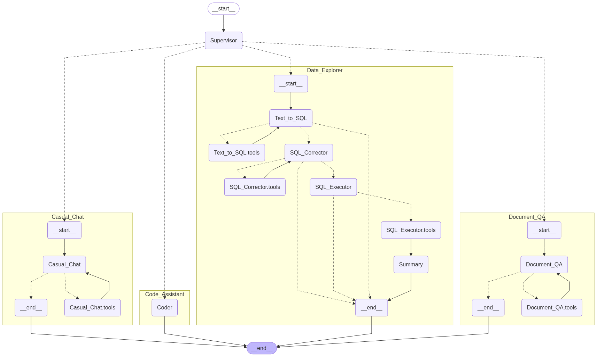

# 🤖 JAY AI Agentic Workflow

A guide to setting up, running, and interacting with the JAY AI Agentic Workflow.

-----

## 🚀 Getting Started

Follow these steps to build and run the project environment.

### 1\. Build Docker Images

Compile all the necessary Docker images for the project.

```bash
docker-compose build
```

### 2\. Run Docker Containers

Run the services using the built Docker images.

**For standard environments:**

```bash
docker-compose up
```

**For environments with an NVIDIA GPU:**

```bash
docker-compose -f docker-compose.yml -f docker-compose.gpu.yml up -d
```

-----

## ⚙️ Configuration & Setup

Install the required LLM models and initialize the database.

### 1\. Install LLM Models (via Ollama)

Pull the large language models that the agent will use.

```bash
# docker exec -it llm-service ollama pull qwen3:8b 
# docker exec -it llm-service ollama pull qwen3:14b
# docker exec -it llm-service ollama pull qwen2.5-coder:7b
docker exec -it llm-service ollama pull gpt-oss:20b # (recommended)
```

### 2\. Initialize Vectorstore Data

Build the vectorstore collections required for the RAG service.

**Build collections:**

```bash
docker exec -it rag-service uv run scripts/build_collections.py
```

**Test the retriever:**

```bash
docker exec -it rag-service uv run scripts/test_retriever.py
```

-----

## 💡 Usage

Interfaces for interacting with the AI agent.

### 🌐 Web UI

Access the LangGraph Web UI to visualize and debug the agent's workflow.

  - **API Docs:** http://localhost:2024/docs
  - **Connect via LangSmith Studio**: https://smith.langchain.com/studio/?baseUrl=http://localhost:2024

### 💻 Command-line Interface

Interact with the agent directly from your terminal.

```bash
docker exec -it agent-service uv run python -m app.cli
```

-----

## 🕸️ Multi-Agent Workflow


The workflow is managed by a supervisor that routes tasks to the appropriate specialist agent based on the user's query.

  - **`Supervisor`**: Interacts with the user to determine their intent and routes the query to the most suitable specialist agent.

### Specialist Agents

Below are the specialized agents in this workflow and examples of queries they handle.

  - **`Document_QA`**: Handles queries related to internal knowledge, such as company documents, policies, and manuals.  
    *Example Queries:*
       - How many vacation days does an employee who has worked for 10 years receive this year?
       - What is the connection address for the production database?
    
  - **`Code_Assistant`**: For tasks involving code generation, modification, analysis, and debugging.  
    *Example Queries:*
       - Write a Python script that creates a simple web server and returns "Hello, World!".

  - **`Data_Explorer`**: Addresses questions requiring data analysis (EDA), database querying, or statistical insights.  
    *Example Queries:*
       - Provide a table showing the number of cards issued by type for each year.

  - **`Casual_Chat`**: Manages general conversations and any non-specialized chat that doesn't fall into the categories above.  
    *Example Queries:*
       - Hi, how are you today?
       - What's the weather like in Seoul and New York now?

-----


## ✅ Text-To-SQL Testing

Example queries to test the Text-to-SQL capabilities.  
(Based on the BIRD development dataset: https://bird-bench.github.io/)

1.  **How many accounts who choose issuance after transaction are staying in East Bohemia region?**

    difficulty: `moderate`
    ```sql
    SELECT COUNT(T2.account_id) 
    FROM district AS T1 
    INNER JOIN account AS T2 ON T1.district_id = T2.district_id 
    WHERE T1.A3 = 'east Bohemia' AND T2.frequency = 'POPLATEK PO OBRATU';
    -- Result: 13
    ```

2.  **How many accounts who have region in Prague are eligible for loans?**
    
    difficulty: `simple`
    ```sql
    SELECT COUNT(T1.account_id) 
    FROM account AS T1 
    INNER JOIN loan AS T2 ON T1.account_id = T2.account_id 
    INNER JOIN district AS T3 ON T1.district_id = T3.district_id 
    WHERE T3.A3 = 'Prague';
    -- Actual Result: 84
    ```

3.  **How many male customers who are living in North Bohemia have average salary greater than 8000?**

    difficulty: `moderate`
    ```sql
    SELECT COUNT(T1.client_id) 
    FROM client AS T1 
    INNER JOIN district AS T2 ON T1.district_id = T2.district_id 
    WHERE T1.gender = 'M' AND T2.A3 = 'north Bohemia' AND T2.A11 > 8000;
    -- Actual Result: 280
    ```

4.  **What is the average loan amount by male borrowers?**

    difficulty: `simple`
    ```sql
    SELECT AVG(T4.amount) 
    FROM client AS T1 
    INNER JOIN disp AS T2 ON T1.client_id = T2.client_id 
    INNER JOIN account AS T3 ON T2.account_id = T3.account_id 
    INNER JOIN loan AS T4 ON T3.account_id = T4.account_id 
    WHERE T1.gender = 'M';
    -- Actual Result: :149609.18048780487
    ```

5.  **For the branch which located in the south Bohemia with biggest number of inhabitants, what is the percentage of the male clients?**

    difficulty: `challenging`
    ```sql
    SELECT CAST(SUM(T1.gender = 'M') AS REAL) * 100 / COUNT(T1.client_id) 
    FROM client AS T1 
    INNER JOIN district AS T2 ON T1.district_id = T2.district_id 
    WHERE T2.A3 = 'south Bohemia' 
    GROUP BY T2.A4 
    ORDER BY T2.A4 
    DESC LIMIT 1;
    -- Actual Result: :44.26229508196721
    ```

-----

## 🧹 Cleanup

Stop and remove the Docker containers and associated volumes.

**Stop and remove containers:**

```bash
docker-compose down
```

**Stop containers and remove named volumes:**

```bash
docker-compose down -v
```

-----

## 📝 TODO List

  - Enhancing prompts based on the [OpenAI Prompting Guide](https://cookbook.openai.com/examples/gpt-5/gpt-5_prompting_guide) cookbook.
  - Adding `Human in the Loop` to the `SQL Executor`'s tool call step.
  - Documenting the system architecture design overview.
  - Automating `Supervisor` agent validation and evaluation.
